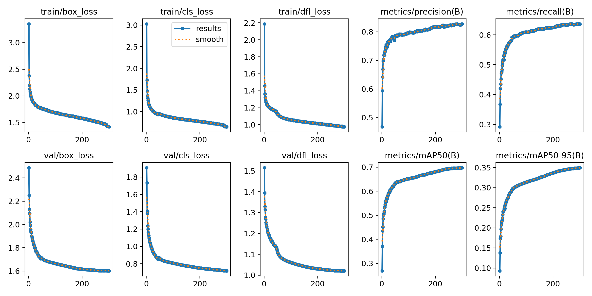
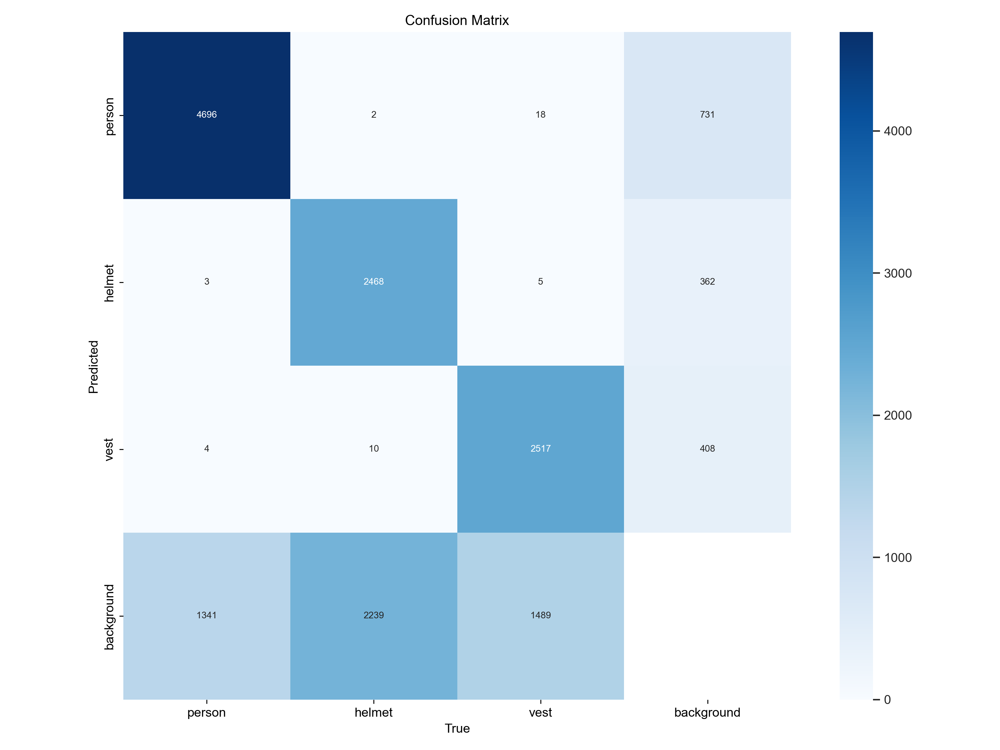

# MFD-YOLO Baseline (YOLOv8n)
Baseline reproduction of YOLOv8n for PPE detection before integrating
the proposed architectural modules (MGPC, MFDPN, DTADH).
This serves as the control experiment for evaluating improvements
introduced in MFD-YOLO.
------------------------------------------------------------------------
## 📊 Results
**Model:** YOLOv8n (from scratch)\
**Image size:** 640\
**Batch size:** 16\
**Optimizer:** SGD\
**Learning rate:** `lr0=0.01`, `lrf=0.01`\
**Epochs:** 300

**Final Metrics:**
-   mAP@0.5: **69.72%**
-   mAP@0.5:0.95: **34.95%**

(Paper-reported baseline: mAP@0.5 = 70.2%)
------------------------------------------------------------------------
## 📈 Training Curves
### Metrics Curve

### Confusion Matrix

(Images generated automatically by Ultralytics after training.)
------------------------------------------------------------------------
## 🖥 Environment
-   Ubuntu 22.04\
-   RTX 3060 Laptop GPU (6GB VRAM)\
-   Python 3.9\
-   Ultralytics 8.2.50\
-   PyTorch (CUDA enabled)
------------------------------------------------------------------------
## 🚀 Training
``` bash
python train_baseline.py
```
------------------------------------------------------------------------
## 🔍 Inference
``` bash
yolo task=detect mode=predict model=weights/best.pt source=image.jpg
```
------------------------------------------------------------------------
## 📦 Requirements
Install dependencies:
``` bash
pip install -r requirements.txt
```
------------------------------------------------------------------------
## 📌 Notes
-   Model trained fully from scratch (no pretrained weights).
-   Official dataset splits were used.
-   This baseline is used for comparison against MFD-YOLO variants.
------------------------------------------------------------------------
## 📄 Reference

[A deep learning-based algorithm for the detection of personal protective equipment](https://doi.org/10.1371/journal.pone.0322115) — Tong et al., PLOS ONE (2025)

**Dataset:** [SODA](https://doi.org/10.1016/j.autcon.2022.104499)
